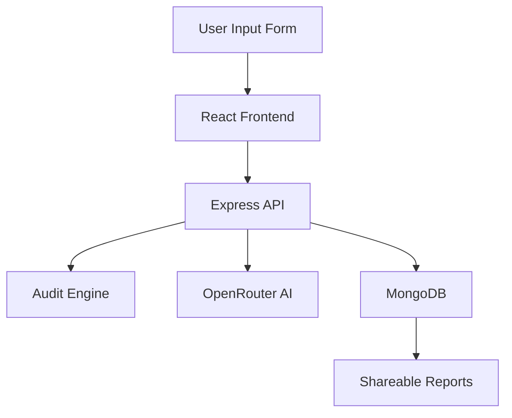

# System Architecture

## Data Flow

1. User submits spend details
2. Frontend sends request to backend
3. Audit engine calculates optimization opportunities
4. AI generates personalized summary
5. MongoDB stores audit
6. Shareable URL generated

## Stack Choice

MERN was chosen for:

- fast development
- JS consistency
- easy deployment
- flexible document storage

## Scaling to 10k audits/day

- Redis caching
- Queue-based AI summary generation
- Horizontal API scaling
- CDN caching for public reports